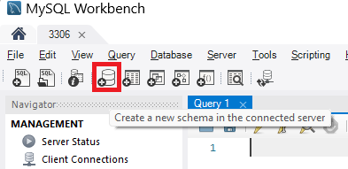
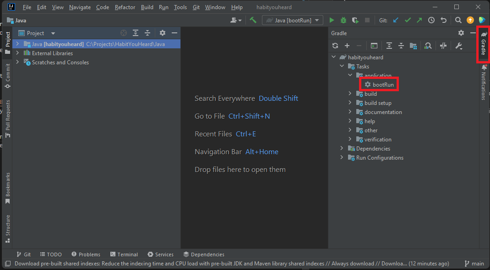

# HabitYouHeard
[INSERT LOVELY DESCRIPTION OF IT HERE WOO]

Original project: [back-end](https://github.com/Jul-2022-LC-LiftOff/HabitYouHeard), [front-end](https://github.com/Jul-2022-LC-LiftOff/Habit-You-Heard-Frontend).  
Created by Micah Young, Raven Almira, Stève Levillain, Eric Smith, and Brandon Cope. This is Brandon's fork of the project.


## Installation
In order to view this project you need: Java, JavaScript, npm, an IDE that has runtime integration, and an open mind.

Use the following command in a directory you wish to install the project.  
&nbsp;&nbsp;&nbsp;&nbsp;
```
git clone https://github.com/CopeBrandon/HabitYouHeard.git
```

### `Java`
In order to install Java follow these instructions: [freecodecamp](https://www.freecodecamp.org/news/how-to-install-java-on-windows/). Install and use Java version 17.

Download IntelliJ or similar IDE. Instructions use Intellij as an example, so it will be easier that way.

Download a version of MySQL Workbench that has server functionality(the non-web, non-client version). We used version 8, and cannot confirm whether any other versions would work. [Here](https://education.launchcode.org/SQL/appendices/mysql-install.html) are some lovely instructions from the codecamp we took, LaunchCode, that will aid you in your installation journey. If this is your first time using MySQL Workbench, DO NOT forget your root password.
### `JavaScript & React`
Make sure that you have npm [installed](https://docs.npmjs.com/downloading-and-installing-node-js-and-npm).

After instaling npm, route to the `Javascript` directory and run the command 
```
npm install
```
to install the required dependencies. May take a while, sorry. :)

---
After all of this you should have your project installed and ready for...

## Setup
### `Back-end`

#### MySQL Workbench. 
---
Open up Local Instance 3306 connection or add a new one.  


>`Each step here is very important that these instructions are followed to the letter.`

1. Create new Schema called  
&nbsp;&nbsp;&nbsp;&nbsp;`habityouheard`  

2. In MySQL, navigate to Administration -> Management -> Users and Privileges  
&nbsp;&nbsp;&nbsp;&nbsp;Click add account. Set login name and password at your whim.
>Make sure that you take note of the login name and password  

3. Navigate to Schema Privileges.  
&nbsp;&nbsp;&nbsp;&nbsp;Click Add Entry Select habityouheard  
&nbsp;&nbsp;&nbsp;&nbsp;Click the Select “ALL” button


#### In IntelliJ
---
I would recommend running the back-end section of the project in its own IDE. If your folder was called HabitYouHeard, then you would open  
&nbsp;&nbsp;&nbsp;&nbsp;`HabitYouHeard/Java`  
Before bootRun, add the previously mentioned login name and password from your Add Account step and create [Environmental Variables](https://education.launchcode.org/gis-devops/configurations/02-environment-variables-intellij/index.html) in IntelliJ named: “DB_LOGIN” And “DB_PASSWORD” respectively. If your login name and password were set to username and password, it would look something like this:
``` 
DB_LOGIN=username;DB_PASSWORD=password;
```
Since IntelliJ uses the Gradle Wrapper, the easiest way to run the program is opening the Gradle tab, navigate to habityouheard -> Tasks -> application -> bootrun.  
  
The API can then be accessed at [http://localhost:8080](http://localhost:8080) via Postman or another tool to access endpoints. Specific endpoint routes can be found by inspecting the Controllers. 

To stop running the project in Intellij, there's a red square you can press to stop, or just close it.
### `Front-end`
This is a lot simpler. Once you have npm installed, navigate to the Javascript portion in your terminal, so if your folder was called HabitYouHeard  
then you would open  
&nbsp;&nbsp;&nbsp;&nbsp;`HabitYouHeard/JavaScript`  
and then run the following command:
```
npm start
```
and it will run, deploying the react side of the project. It should open the page on your browser, but if it doesn't you can type localhost:3000 into your navbar of choice and it will route you to our project.

To stop running the project, press ctrl+c in the terminal or close it.

# Clean Up
If you wish to clean up the project after having installed it, make sure that you uninstall MySQL Workbench(it uses resources when not being used) and delete all project files. Easy as.
